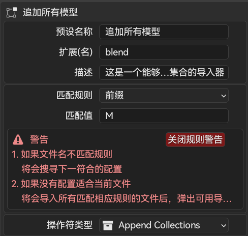
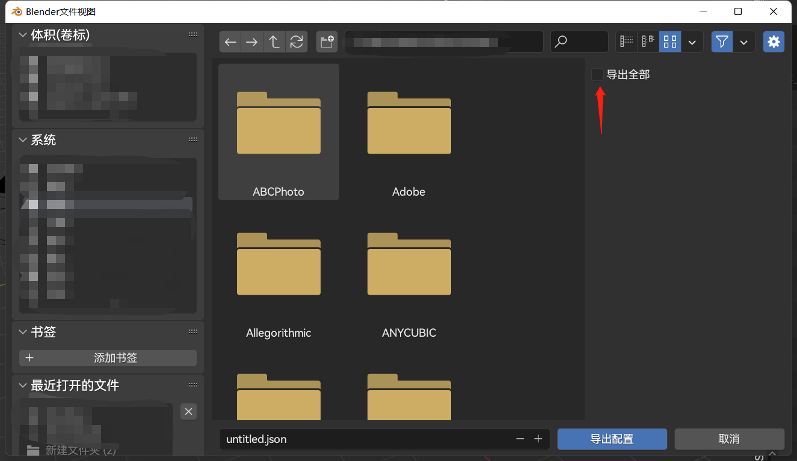

### 增加/移除/复制

> 注意，需要保存blender偏好设置才可将新添加的配置保留在插件中，或使用导出配置命令将配置导出为json文件，以防丢失

##### 增加

只需要点击列表旁的➕,即可完成自定义配置的添加。

添加配置后，可以为配置指定名字，提示，适用格式，操作符类型

不同配置可针对同一扩展名，当多个配置冲突时（使用[规则](/zh-cn/AddRule.md)以避免冲突），则将弹出**选择菜单**，供用户选择相应配置导入 此菜单上将配置名字和提示作为**按钮名字**与**按钮提示**

##### 移除
点击➖可将当前选中配置移除。
此操作不可撤销，需谨慎。若误删切开启了自动保存偏好设置选项，可立刻关闭当前blender（不保存）

##### 复制
复制当前选中配置，黏贴至新配置中

### 配置导入/导出

使用导出配置命令，可将当前已勾选的所有配置导出至json文件。若勾选侧边的导出全部选项，则导出配置列表中的已有配置

使用导入配置命令，可导入由上述操作导出的文件配置添加至列表中（若已存在相同命名的配置，则忽略）

### 搜索匹配
SPIO 提供了丰富的过滤系统以确保快速找到想要编辑的配置

+ 名字：搜索配置的名字 (默认)

+ 扩展名：搜索匹配该扩展名（文件格式）的配置

  

+ 规则：搜索配置的规则类型

  

+ 颜色：搜索符合当前颜色的配置（默认为无色）

  

