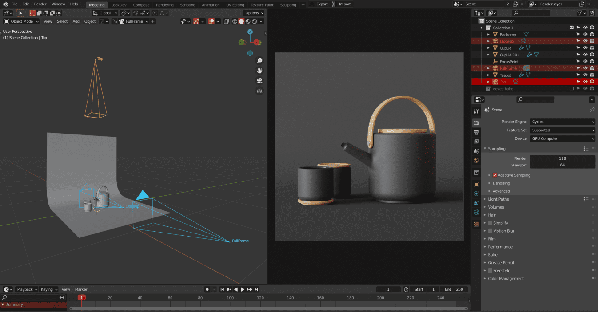
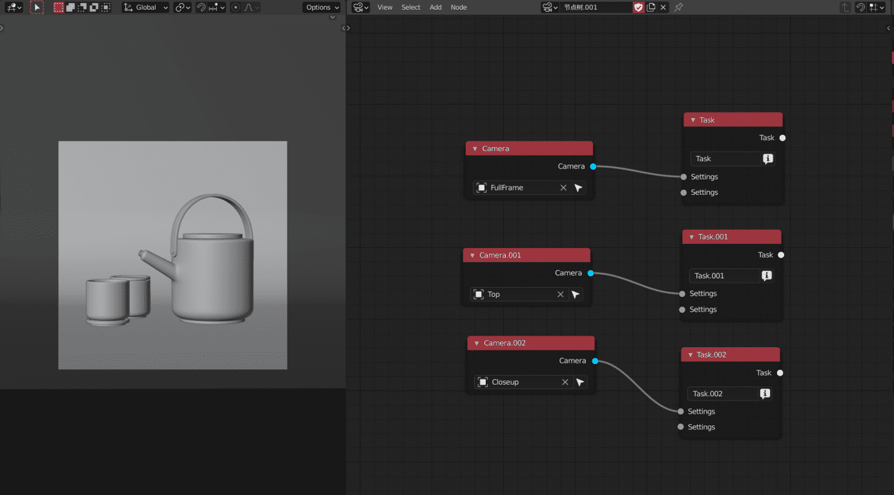
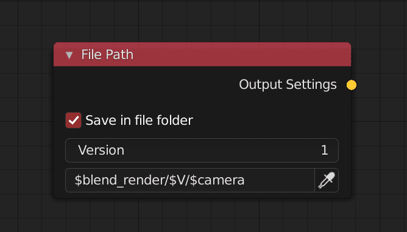
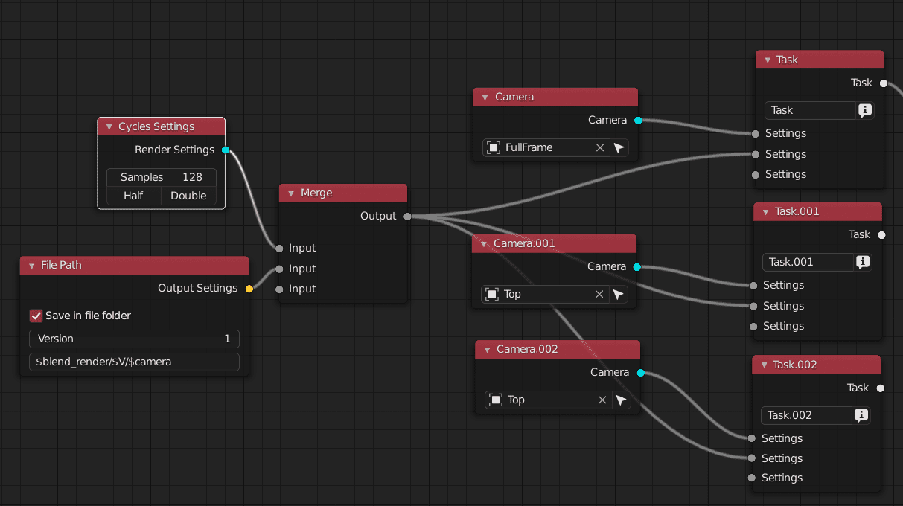
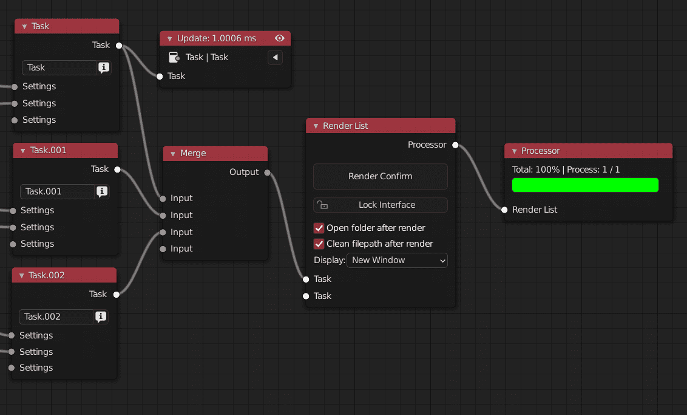
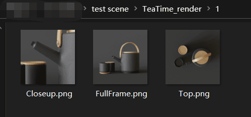

### Usage scenarios

> A designer needs to render the teapot and cup which he has made. The designer is expected to produce three pictures for graphic design: top view (orthogonal), full frame (50mm), close-up (110mm) According to the design process, after setting up the model, lighting and camera, the designer needs to submit a preview image to the client *low sampling / low resolution*   After confirming the modification details, he can render the final image *high sampling, high resolution*
>

<!-- panels:start -->

<!-- div:title-panel -->

### Set Preview

<!-- div:left-panel -->

<!-- div:right-panel -->

1. Make new RSN node panel,
2. add 3 task nodes and 3 camera nodes ,connect them respectively,
3. select the task node and press V to preview the camera view of the selected task

> [!TIP]
> so the output image will be placed in the folder where the scene file is located with the version property as the sub folder and the camera name as the image name This makes it easy to change multiple versions.

<!-- panels:end -->

<!-- panels:start -->

<!-- div:title-panel -->

### Set File Path

<!-- div:left-panel -->

<!-- div:right-panel -->

add a filepath node and name the path expression `$blend_render/$V/$camera` 

<!-- panels:end -->

<!-- panels:start -->

<!-- div:title-panel -->

### Next, configure rendering sampling:

<!-- div:left-panel -->

<!-- div:right-panel -->

1. add cycles settings node, add path node
2. press f to open RSN help menu, select merge selection
3. select three task nodes and new merge nodes, call out help menu, select connect single node to multitask command.

<!-- panels:end -->

<!-- panels:start -->

<!-- div:title-panel -->

### Render Image

<!-- div:left-panel -->

<!-- div:right-panel -->

Finally, add rendering list and progress bar nodes (not necessary), use the help menu to quickly connect, and click to confirm rendering to start rendering.

> [!TIP]
> If designer need to make preview image He just need to click the half button to automatically halve the sampling, and then change the version slider of the path node to change the output path.

<!-- panels:end -->

### Render Result

### 