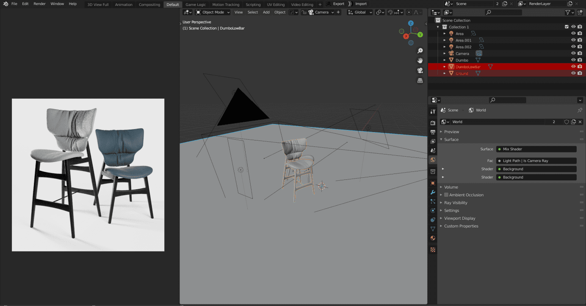
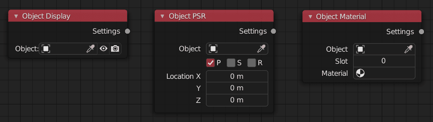
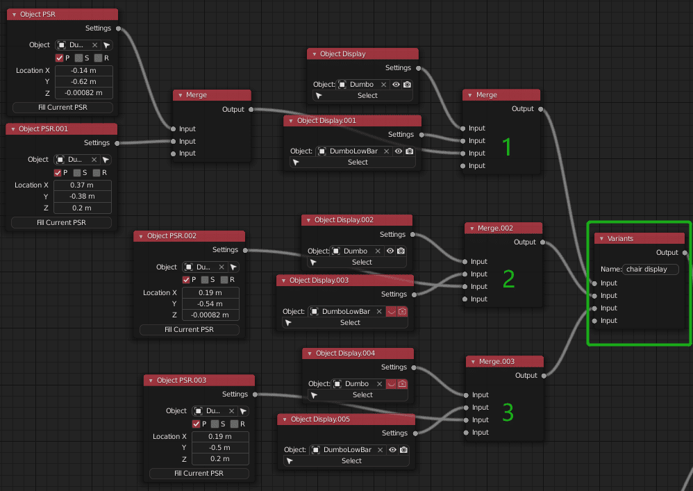
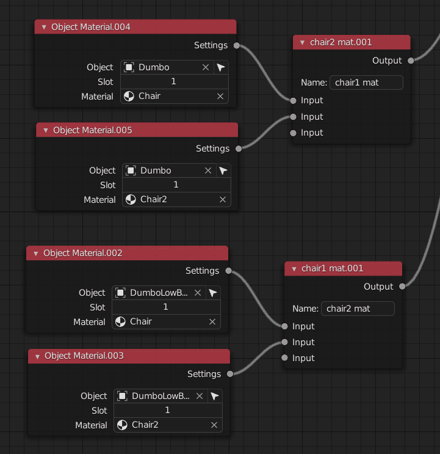
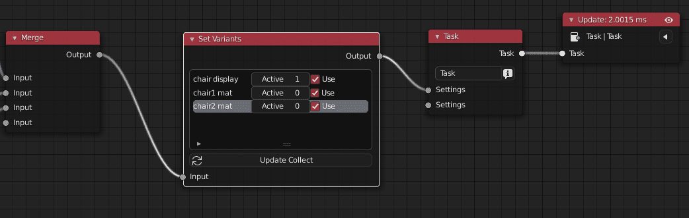
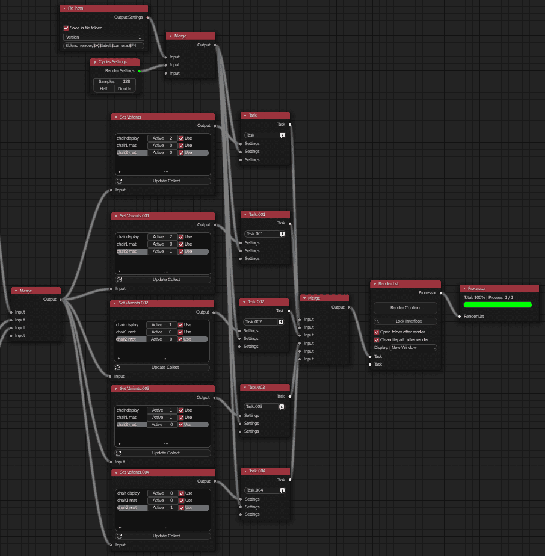
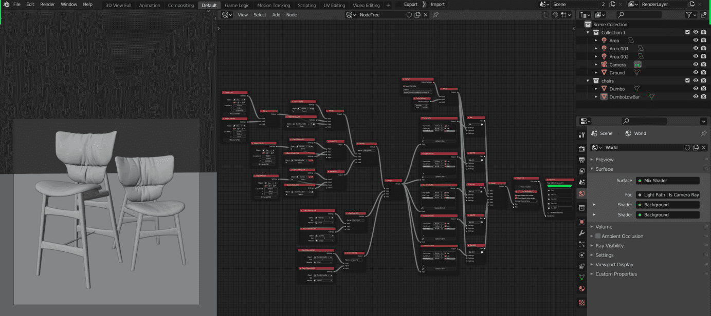
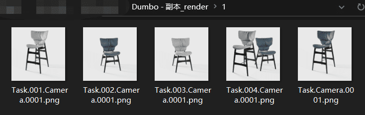

### Usage scenarios

> There is a designer who needs to shade and render two chair from the client (given models are shown in the figure)  The customer sent some reference pictures of cloth, hoping that he could make some materials for him to compare.  The designer gave the client screenshots of chairs made of different materials.   The client finally finalized two kinds of materials and put forward the following requirements:
>
> a. Each chair shows two materials,solo in one image (four image in total), b. Combine 2 chairs in one image (different materials)

<!-- panels:start -->

<!-- div:title-panel -->

### Concluded requirement and Set Variants

Because of the large number of case variables, we will use variant and set variant nodes to manage the scene without copying the chair

<!-- div:right-panel -->

> [!NOTE]
>
> 
>
> | name/variants input | input 0 | input 1 |
> | ------------------- | ------- | ------- |
> | chair 1 display     | true    | false   |
> | chair 2 display     | true    | false   |
> | chair 1 position    | middle  | side    |
> | chair 2 position    | middle  | side    |
> | chair 1 material    | mat 1   | mat2    |
> | chair 2 material    | mat 1   | mat2    |
>
> After a brief summary of the varieties  it is found that the position of the chair is related to the display of the chair
>
> | name/variants input                 | input 0                     | input 1             | input 2             |
> | ----------------------------------- | --------------------------- | ------------------- | ------------------- |
> | chair display (display,position) | all chair left / right | chair 1 middle | chair 2 middle |

<!-- div:left-panel -->

Use object display node, object PSR node and object material node respectively

#### Variant: chair display

#### Variants: chair 1&2 material 

<!-- panels:end -->

### Set the preview task

1. connect the set variant node

2. change the activation value in the set variant node to change the used variant input

Now you can continue to preview and adjust the position and material of the chair

### Ready for one click rendering

 use the RSN help menu to quickly set the rendering list and output path

So far, the entire node tree has been set

### Render Result

