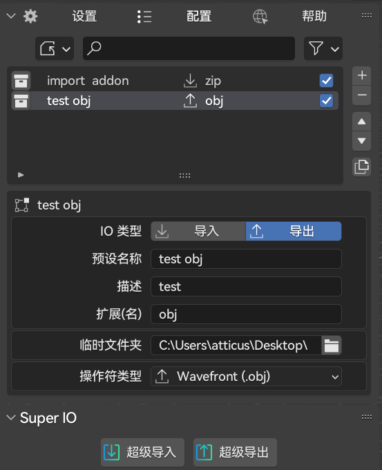

You can add a temporary file to the configuration to output the file to the specified location

If the temporary file of the current configuration item is empty, spio will export the file to the global temporary folder of blender
If the global temporary folder of Blender is empty, it will use Blender's own method to temporarily store the files (after closing Blender, the temporary files will be emptied)
