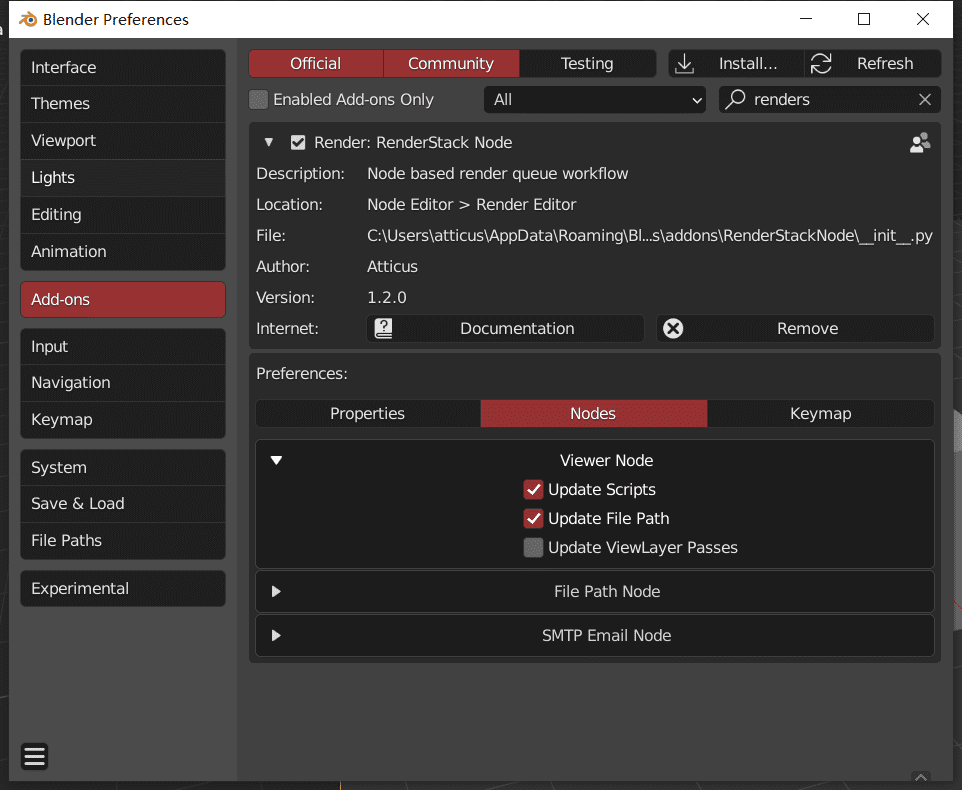
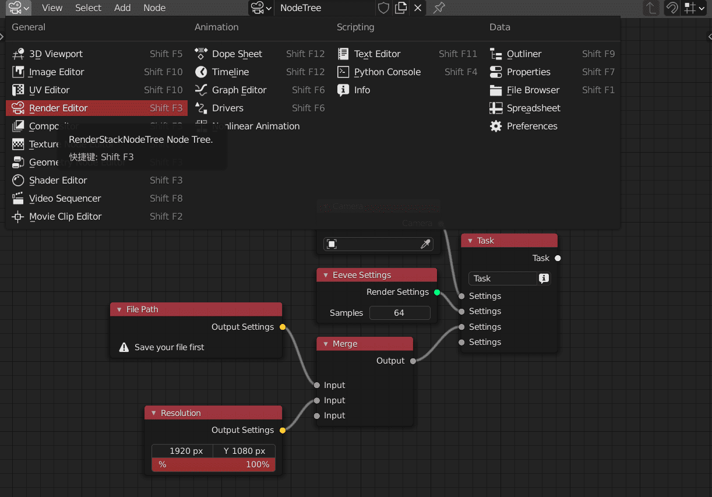

> You can find RSN at these place

<!-- panels:start -->

<!-- div:title-panel -->

### Preference

<!-- div:left-panel -->

<!-- div:right-panel -->

> [!TIP]
> You can change some UI color/the behavior of some nodes/shortcuts here

<!-- tabs:start -->

### **Property**

set your log level warning is default. It only show the user's error

### **Nodes**

set the default behavior of some nodes

+ Task(Update option)
    + viewport / render update option
+ FilePath
    + the default path expression of the file path node, check for more details
+ SMTP
    + you can fill in your smtp server and password here, so that you are able to use the SMTP node

### **Keymaps**

change your shortcuts

+ Set active task : select a task node and press the shortcut
+ Mute node : mute the selected nodes
+ Helper menu : pie menu in the node editor
+ Quick Search : quick search and add nodes

<!-- tabs:end -->

<!-- panels:end -->

<!-- panels:start -->

<!-- div:title-panel -->

### Node Editor

<!-- div:left-panel -->

<!-- div:right-panel -->

> [!TIP]
> Most of your operations will be done here

<!-- panels:end -->

<!-- panels:start -->

<!-- div:title-panel -->

### Pie Menu / Side Menu

<!-- div:left-panel -->

<!-- div:right-panel -->

> [!TIP]
> A help menu for productivity in the node editor

+ Merge Selection : merge selected nodes (task node or settings nodes) to a merge node
+ Make Various : make various version with selected nodes
+ Link to Muti Task : Link active node to selected task node

<!-- panels:end -->

