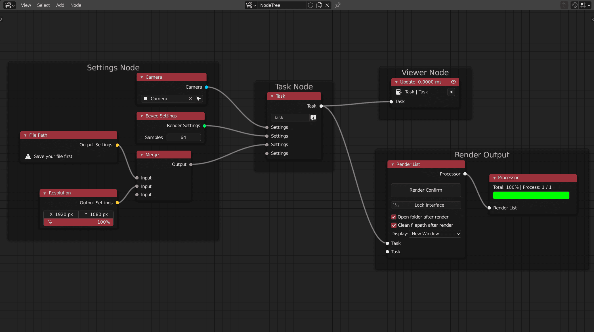

RenderStackNode is an addon that provide users with node based, flexible rendering output workflow.  
It can be also use in look-dev or design. 

## What can RSN do

> [!NOTE]
> **The core of RSN is to modify the data in the scene before rendering, which makes it more flexible**  

+ Render **multiple shots** in the scene, and take the name of the camera as the name of the output image   [👉Link](Example1.md)
+ In each shot, objects' **placement, material and data** can be different   [👉Link](Example2.md)
+ Add **animation** to one of the shots, and render with another rendering engine (such as workbench)
+ If you are not sure how long a shot will be rendered, you can send a report email to the specified email after
  rendering
+ Just press the button, you can **queue render** all the above needed shots without waiting in front of the computer

<!-- panels:start -->

<!-- div:title-panel -->

## Download

<!-- div:left-panel -->

**Latest** *New fixes*:

[https://github.com/atticus-lv/RenderStackNode/archive/main.zip](https://github.com/atticus-lv/RenderStackNode/archive/main.zip)

**Stable** *Ready for work*

[Stable 📚 ](https://github.com/atticus-lv/RenderStackNode/releases/latest)

**Develop** *New features*

https://github.com/atticus-lv/RenderStackNode/archive/develop.zip

<!-- div:right-panel -->

> [!TIP]
> If you are familiar with git `cd C:\Users\{YourUserName}\AppData\Roaming\Blender Foundation\Blender\2.93\scripts\addons`(Windows for example) `git clone https://github.com/atticus-lv/RenderStackNode.git`

<!-- panels:end -->

<!-- panels:start -->

<!-- div:title-panel -->

## How it works

<!-- div:left-panel -->

<!-- div:right-panel -->

> [!NOTE]
> **RSN takes the node settings, and use it to overwrite the scene**

1. There are some settings node in the scene:

    + **Camera Node** have the ability to change the camera
    + **File path Node** give an format name of the render files
    + **Eevee Setting Node** means that in this task you will render with the eevee engine

2. **Task Node** to merge your changes into one render task (so it can be use to render)

3. **Viewer Node**  apply and view the changes

4. **Render List Node**  render all the task that you need

*Once you plug a node settings to overide something into the a task,the next task will inherit it if there is not a same
type Node plug input.  So you may start a new render list to keep your node tree cleaner*

<!-- panels:end -->

