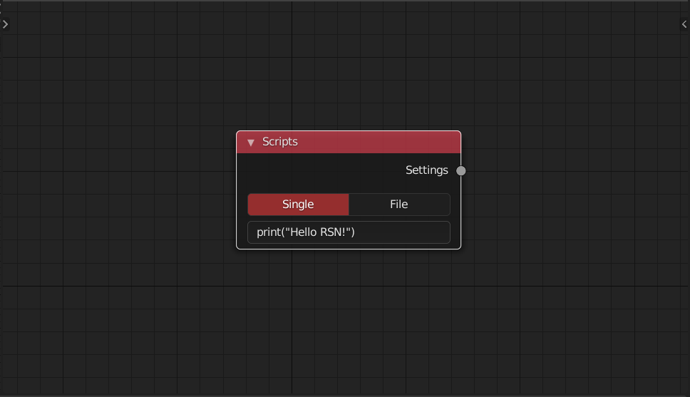
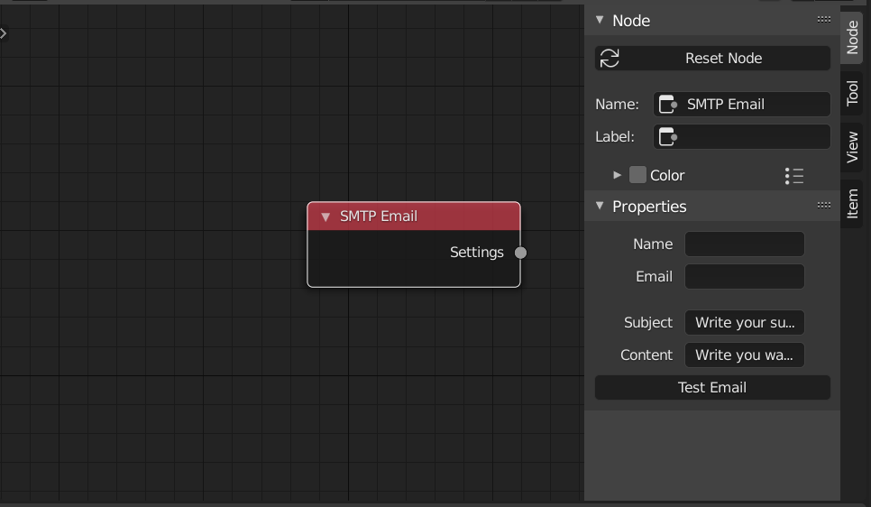
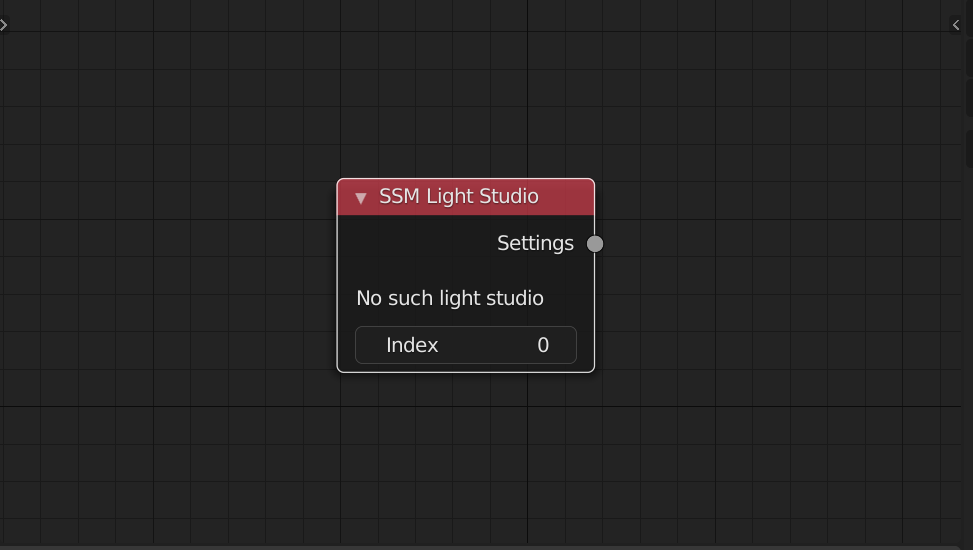

<!-- panels:start -->

<!-- div:title-panel -->

### Scripts

<!-- div:left-panel -->

<!-- div:right-panel -->

> This node allow you to execute a single line script or a internal python file before rendeing. You can use it to change any properties that current nodes can not access
>

<!-- panels:end -->

<!-- panels:start -->

<!-- div:title-panel -->

### SMTP Email

<!-- div:left-panel -->

<!-- div:right-panel -->

> This node allow you to send smtp mail Please enter your server and password in the preference. Only execute while renderstack, but you can use the **test email button** for a test
>

<!-- panels:end -->

<!-- panels:start -->

<!-- div:title-panel -->

### SSM LightStudio

<!-- div:left-panel -->

<!-- div:right-panel -->

> This node can work with 'smart scene manager' addon.  It can read the light studio information of it
>

<!-- panels:end -->