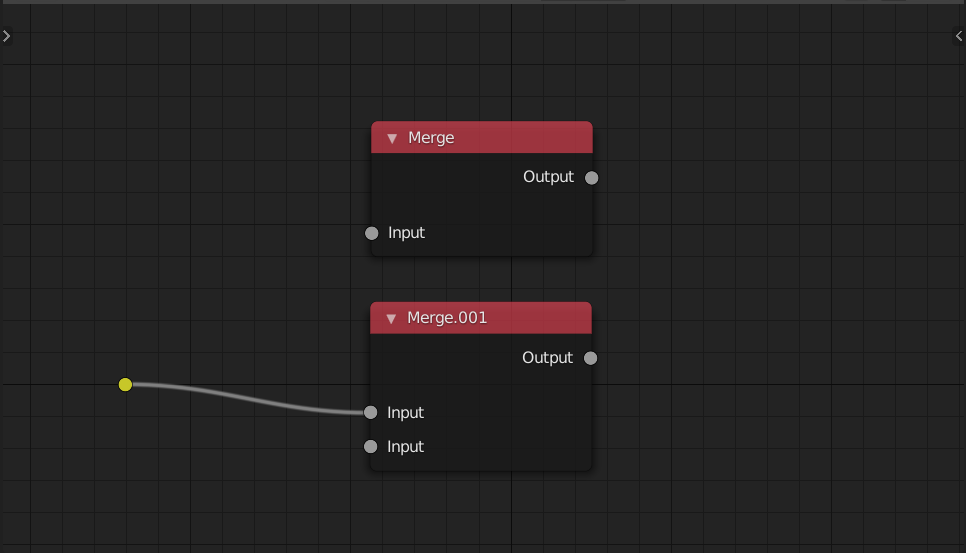
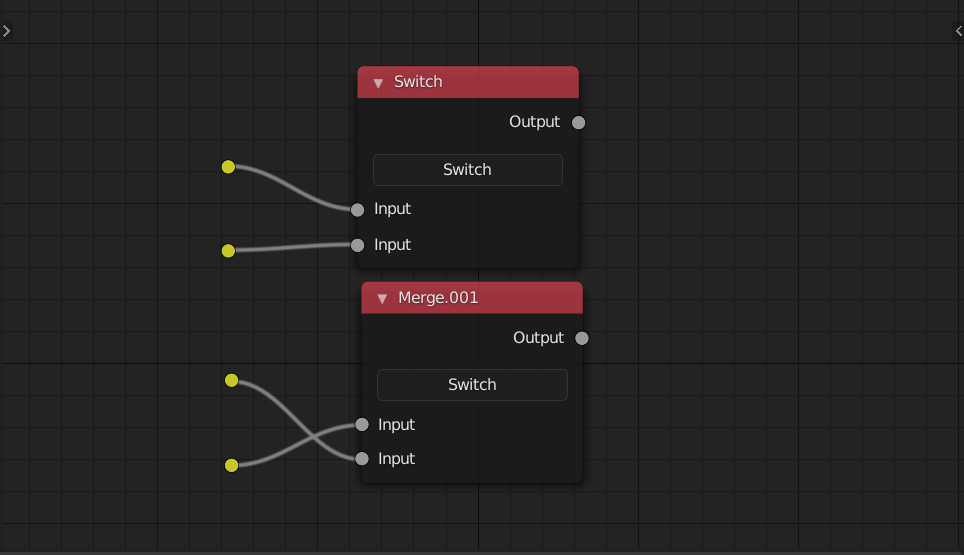

<!-- panels:start -->

<!-- div:title-panel -->

### Merge

<!-- div:left-panel -->

<!-- div:right-panel -->

> This node allow you to merge different settings into one task. And you can merge different tasks into the render list node, too.

<!-- panels:end -->

<!-- panels:start -->

<!-- div:title-panel -->

### Switch

<!-- div:left-panel -->

<!-- div:right-panel -->

>
> This node allow you to switch input order You use it on some toggle operations

<!-- panels:end -->

