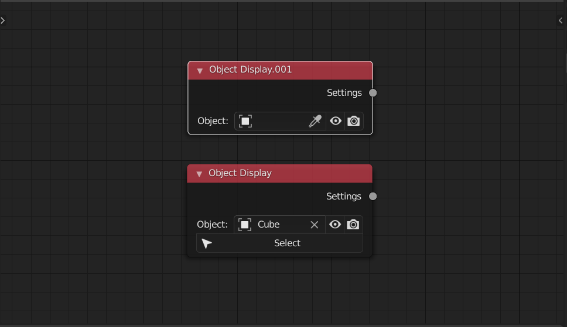
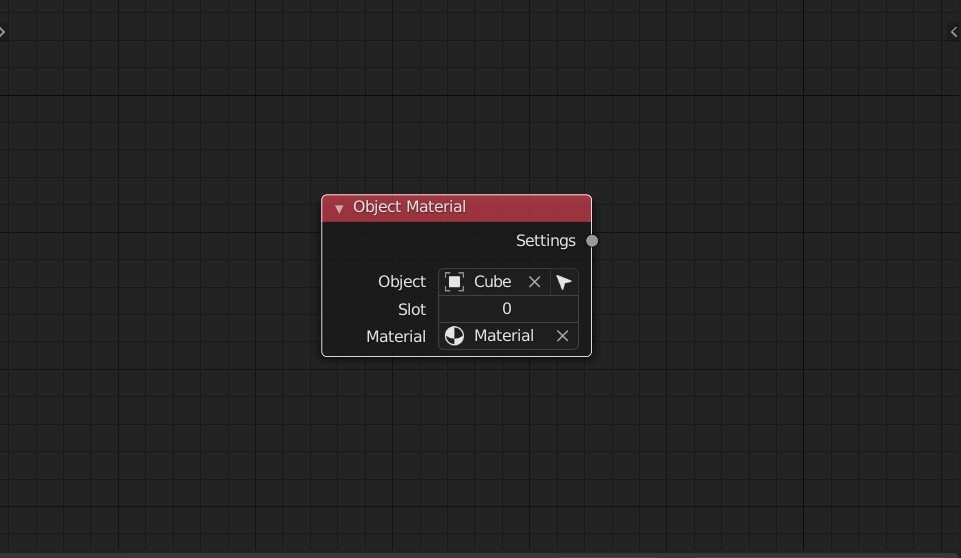
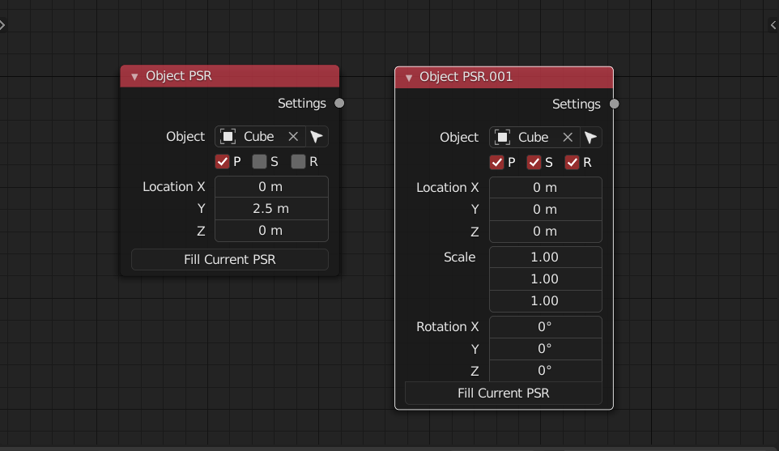
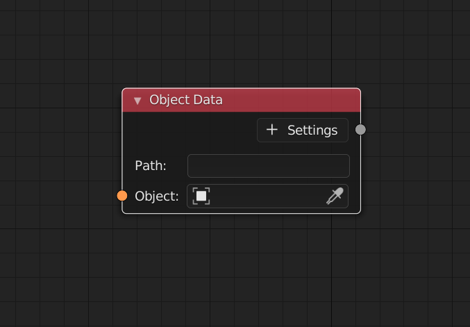
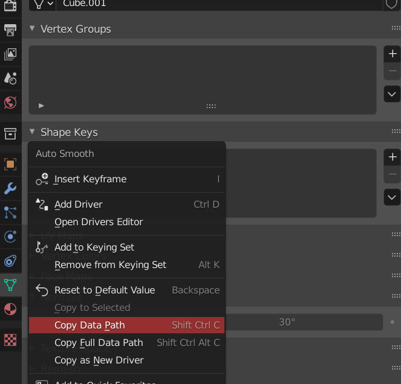

<!-- panels:start -->

<!-- div:title-panel -->

### Object Display

<!-- div:left-panel -->

<!-- div:right-panel -->

> This node control the viewport display and render display of a single object. It provide a smaller changes compare to the view layer node(make new viewlayer and collection)
> 

<!-- panels:end -->

<!-- panels:start -->

<!-- div:title-panel -->

### Object Material

<!-- div:left-panel -->

<!-- div:right-panel -->

> This node allow you to assign a material into an object' material slot

<!-- panels:end -->

<!-- panels:start -->

<!-- div:title-panel -->

### Object PSR

<!-- div:left-panel -->

<!-- div:right-panel -->

> This node can pick up and apply location, rotation euler, scale of the object

<!-- panels:end -->

<!-- panels:start -->

<!-- div:title-panel -->

### Object Data

<!-- div:left-panel -->

<!-- div:right-panel -->

> This node can changes object's data properties ( The green icon in the properties panel )

First select the object then right click on the property you want to pick then **Copy data path**, paste it in the node's data path. Now support Int, Float,Color,Vector,Boolean,String value. 

<!-- panels:end -->

## Obsolete Nodes

<!-- panels:start -->

<!-- div:title-panel -->

### Object Modifier 

<!-- div:left-panel -->

<!-- div:right-panel -->

> This node can changes object's modifiers' properties  ( The blue spanner icon in the properties panel 

First select the object, then right click on the property you want to pick then **Copy data path**, paste it in the node's data path. Now support most modifier (except for the geometry node modifier) 

<!-- panels:end -->
