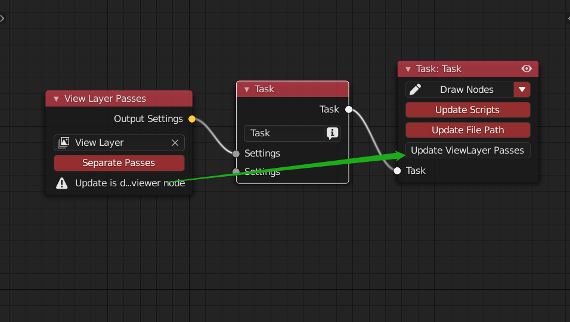
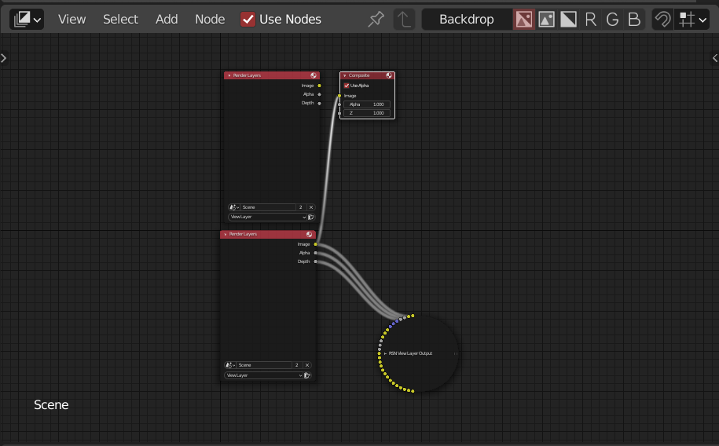
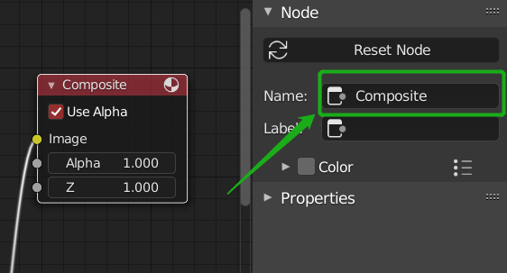
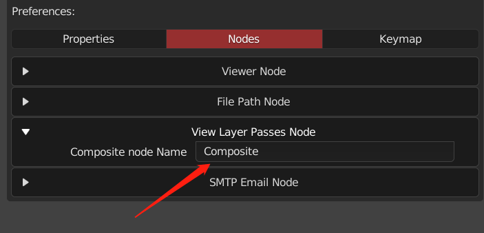
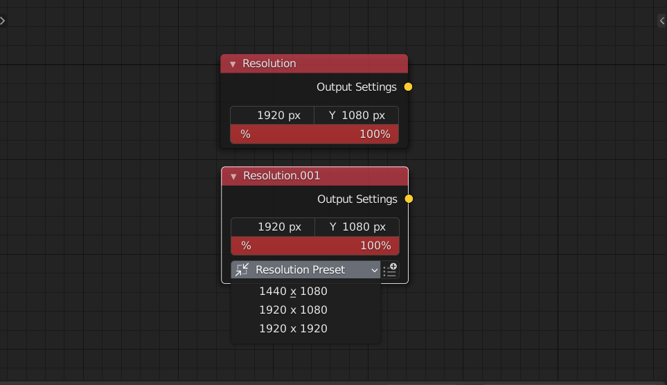
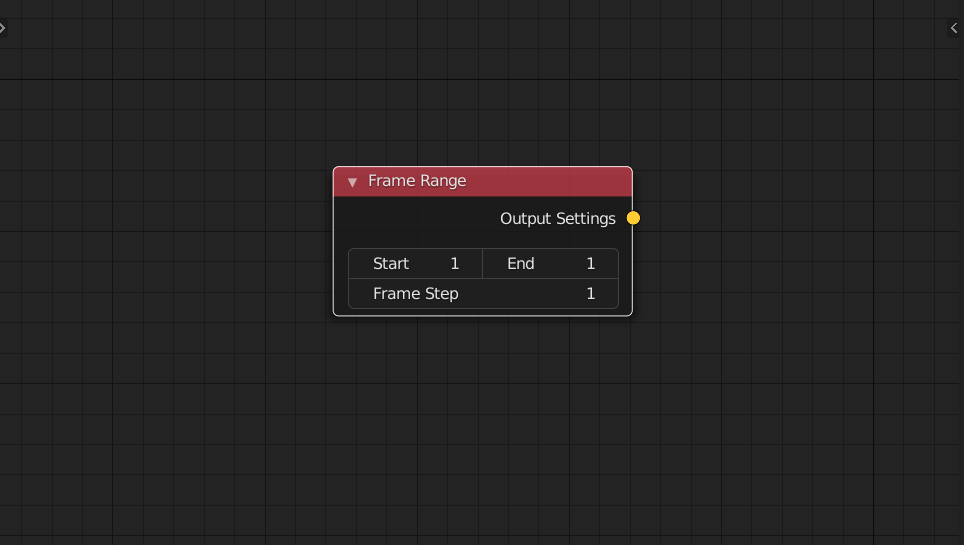
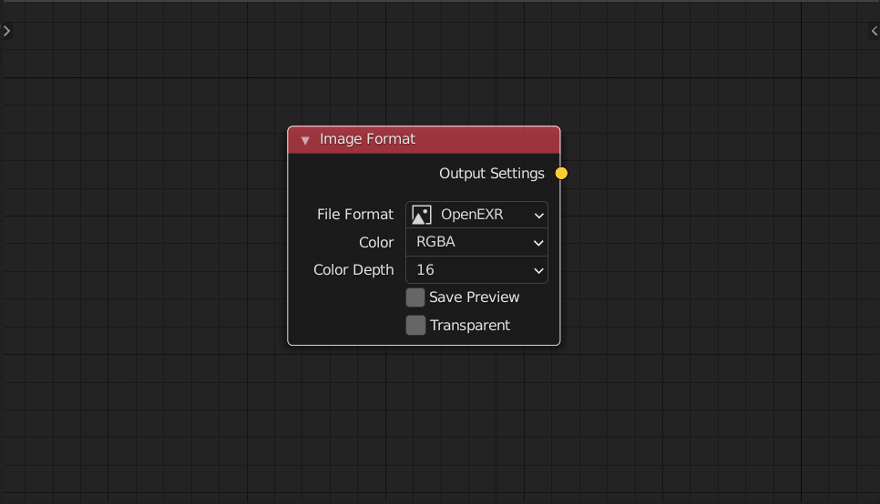
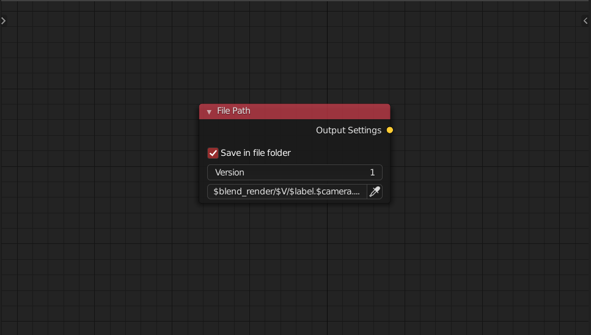
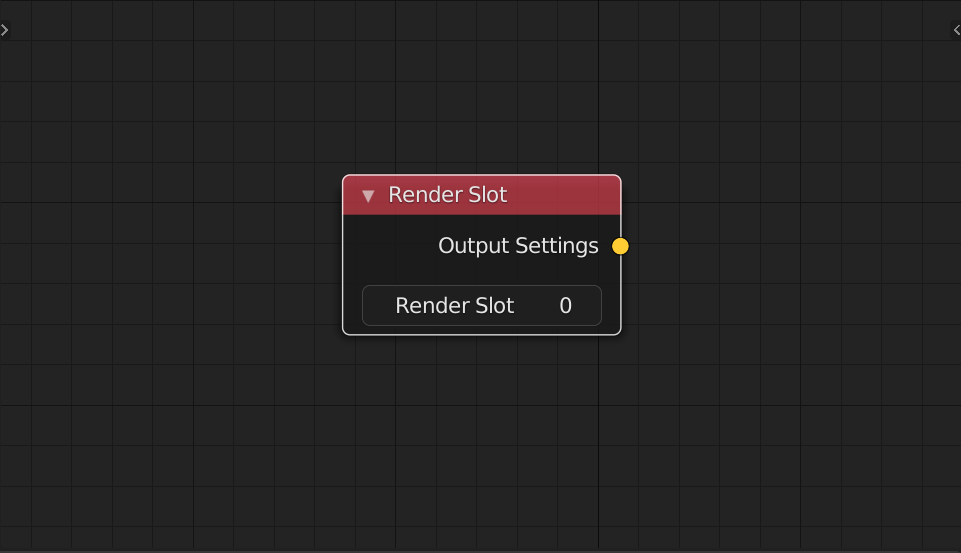

### **Scene File Path**

This node use $ to get the properties of the render task,then apply it to the output file name

### Scene Image Format

Provide the all format for image

###  Scene Frame Range

This node can change the output frame range.<br>You can use it for render animation. If not link to the task node, the task will inherit the context frame of the scene(only render one frame in render list)

### Scene Resolution

This node can change the output resolution

When this node is active, you can notice that you can use the preset of blender resolution

### Scene Render Slot

This node allow you to put the render result into different render slot of the image eidtor

Make sure your translation not change the name of 'Render Result' image

<!-- panels:start -->

<!-- div:title-panel -->

### View Layer Passes

<!-- div:left-panel -->





<!-- div:right-panel -->

> This node allow you to output different passes of a select viewlayer <br>if you need to disble this option, you need to link a new node to disable it .

Make Sure your composite node is name "Composite"(by default)<br>or you will get an Runtime Error<br>

You can also change the default after version 1.2.3(for those who wany to keep the translation for the New Data)<br>

<!-- panels:end -->


## Obsolete Nodes

> The Following nodes are Obsolete.<br>Most of them can be replaced by new nodes<br>Although it still works, it is not recommended

<!-- panels:start -->

<!-- div:title-panel -->

### Resolution

<!-- div:left-panel -->



<!-- div:right-panel -->

> This node can change the output resolution
>
> When this node is active, you can notice that you can use the preset of RSN<br>you can also enable the button besides, and change it to add/remove preset mode

<!-- panels:end -->

<!-- panels:start -->

<!-- div:title-panel -->

### Frame Range

<!-- div:left-panel -->



<!-- div:right-panel -->

> 
> This node can change the output frame range.<br>You can use it for render animation. If not link to the task node, the task will inherit the context frame of the scene(only render one frame in render list)

<!-- panels:end -->

<!-- panels:start -->

<!-- div:title-panel -->

### Image Format

<!-- div:left-panel -->



<!-- div:right-panel -->

> Provide the 3 base format for output.<br>Also can handle the transparent of the image(Only for blender built-in engine), make sure select RGBA to save the alpha channel
> 

<!-- panels:end -->

<!-- panels:start -->

<!-- div:title-panel -->

### File Path

<!-- div:left-panel -->



<!-- div:right-panel -->

> This node use $ to get the properties of the render task,then apply it to the output file name

Usage(Also show in the side pannel):

```
$blend: name of your file (save first!)
$label: Task label
$camera: name of scene camera
$res: resolution (X x Y)
$engine: render engine
$vl: name of scene view layer
$date: month-day
$time: hour-min
/: create folder,should be dict_input folder name in front of "/"
```

<!-- panels:end -->

<!-- panels:start -->

<!-- div:title-panel -->

### Render Slot

<!-- div:left-panel -->



<!-- div:right-panel -->

> This node allow you to put the render result into different render slot of the image eidtor

<!-- panels:end -->