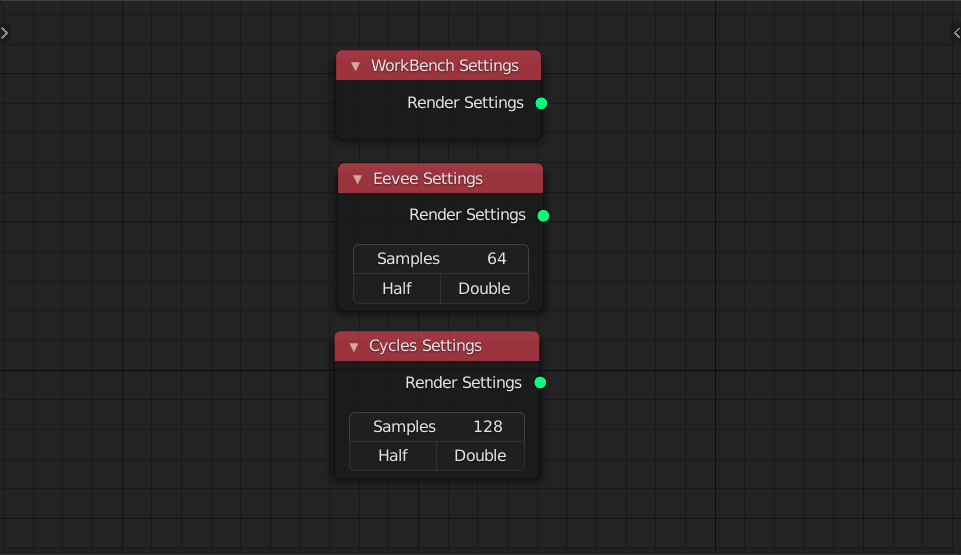
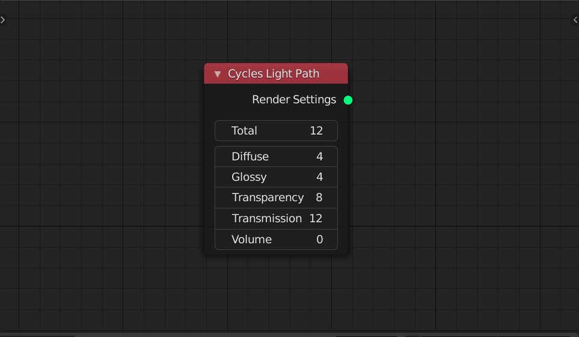
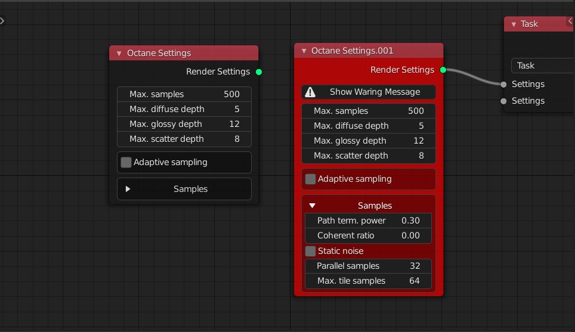
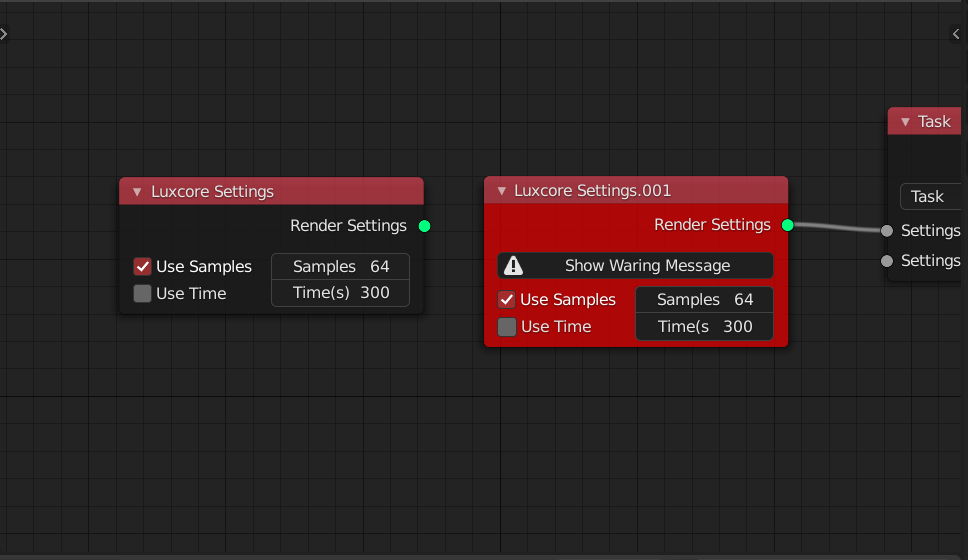

<!-- panels:start -->

<!-- div:title-panel -->

###  WorkBench / Eevee / Cycles Settings

<!-- div:left-panel -->

<!-- div:right-panel -->

> Change the render engine to WorkBench / Eevee / Cycles

**Half / Double buttons** and half and double you samples

<!-- panels:end -->

<!-- panels:start -->

<!-- div:title-panel -->

### Cycles Light Path

<!-- div:left-panel -->

<!-- div:right-panel -->

> Change Cycles' light path property

<!-- panels:end -->

<!-- panels:start -->

<!-- div:title-panel -->

### Octane Settings

<!-- div:left-panel -->

<!-- div:right-panel -->

> Change the render engine to Octane
>
> If you not enable or install octane,  the node will became red to warn you 

<!-- panels:end -->

<!-- panels:start -->

<!-- div:title-panel -->

### Luxcore Settings

<!-- div:left-panel -->

<!-- div:right-panel -->

> Change the render engine to Luxcore
>
> If you not enable or install luxcore,  the node will became red to warn you 

You need to choose **Use time** or **Use sample** to stop luxcore rendering in the end

<!-- panels:end -->