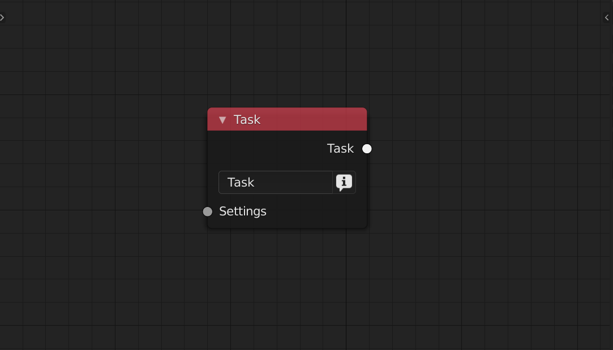
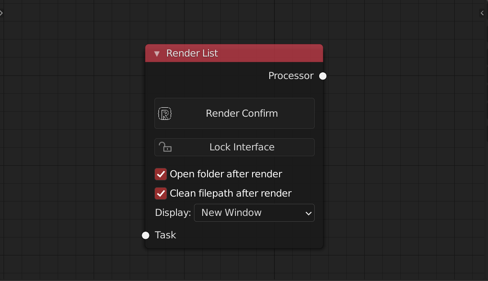

<!-- panels:start -->

<!-- div:title-panel -->

### Task

<!-- div:left-panel -->

<!-- div:right-panel -->

> Task node is the most important node of rsn. It contains changes for a task that can be use for render
>
> **Settings Input** can plug in any kind of settings node **Task output** can connect to RenderList node and merge node

**Label** can be use in the file path node as output name

**Eye Button** set as the current ative task

<!-- panels:end -->

<!-- panels:start -->

<!-- div:title-panel -->

### Render List

<!-- div:left-panel -->

<!-- div:right-panel -->

> Render list will get all the task that links to it. 
>
> **Task input** can connect to Task node or merge node

<!-- panels:end -->