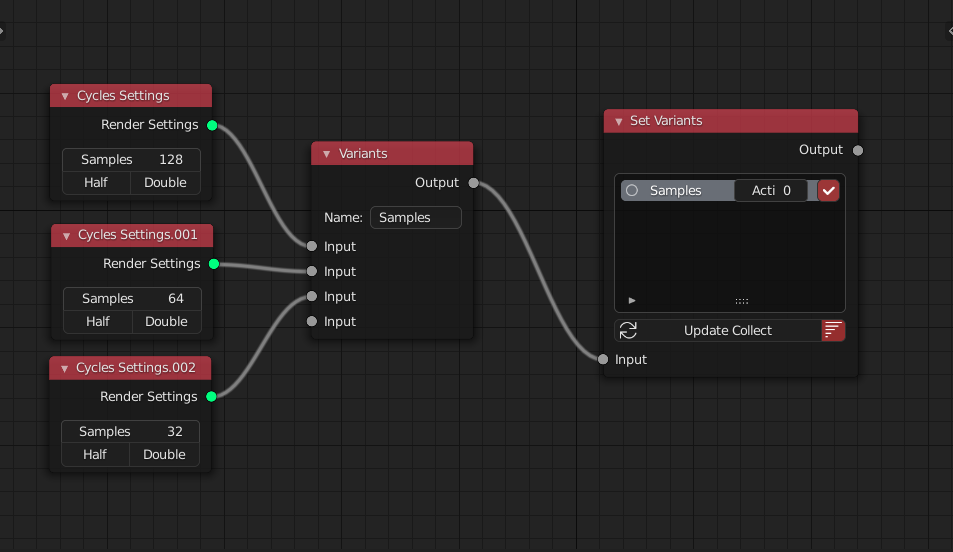

<!-- panels:start -->

<!-- div:title-panel -->

### Variants / Set Variants

<!-- div:left-panel -->

<!-- div:right-panel -->

> A variant node can set multiple variants for a single node. When a set variant node controls it to connect to a task node, it will only be read the active variant

**Name** is the unique identifier for the  **Variants node**

**Update Collect** in **Set Variants node** will collect all the variants node connect to it and then add to the list. Then you can set the active variant in this node.The **sort button** beside it will sort the variants node by their name

<!-- panels:end -->

