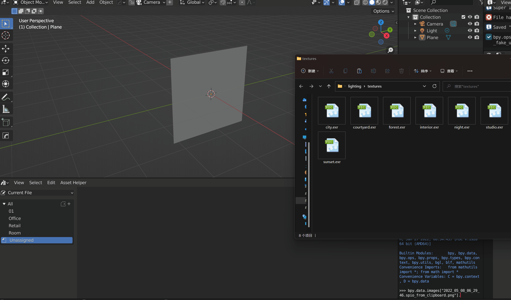
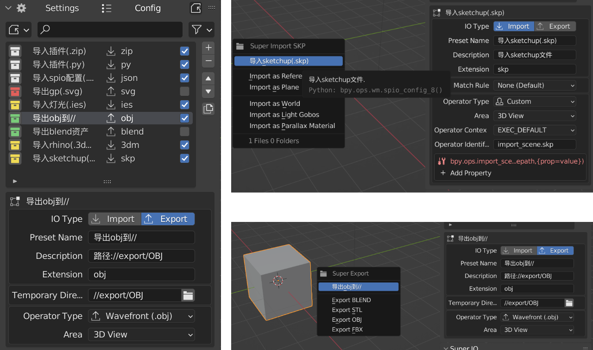
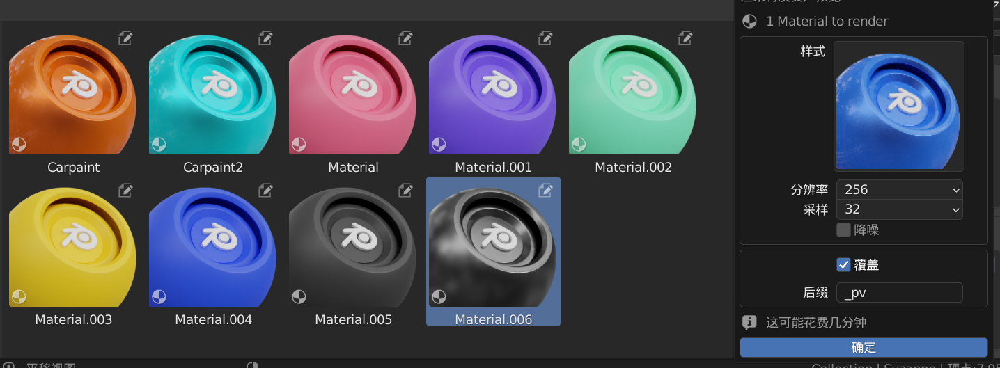
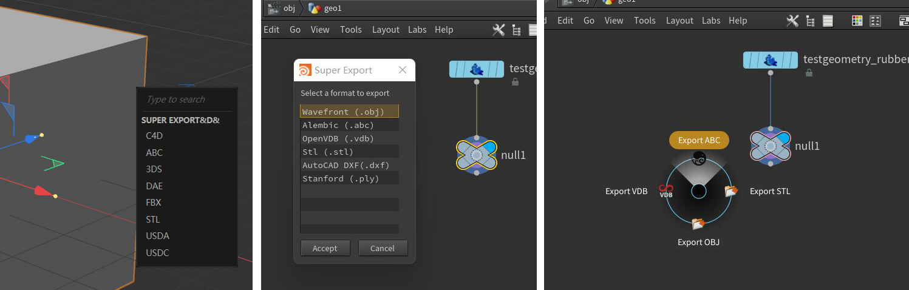

  

<h4 align="center">
    Allow you to copy and paste to import / export models and images.  
</h4>

    Documentation ➡️
    <a href="https://atticus-lv.gitee.io/super_io/#/">
	[Gitee] 
    </a>
    Blender 2.83 ~ 3.2

# Intro

**SPIO is a blender addon that allow you to copy and paste to import or export.**

Currently we can not drag and drop to import model in blender, but with this addon, you can easily copy your model/Image
in your File Explorer, then paste in blender with **just one click/shortcut**,which has improved the efficiency of
importing and exporting blender files / Models / pictures

With third-party Scripts, you are allowed to copy/paste among blender, Cinema 4d and Houdini

> Support windows / Mac platforms(Not Fully Support, only win with c4d/houdini addon)
>

# Contributing

Translation, documentation, different platform support.

And new features which come from great idea!

# Feature

> Check the [document](https://atticus-lv.gitee.io/super_io/#/) above for more information

### Import

> Supports multi-format import (recommended only when importing textures)

#### Import by default

+ PS selection screenshots directly copied and imported

+ AI vector graphics directly copied and imported

+ copy file/dir path to import files

+ All model formats supported by blender (batch)

+ blender file (batch)

#### Import presets

+ Import pbr image and set bsdf material (develop basic on node wrangle)

+ Batch import folder containing pbr images as materials

+ Import image as plane

+ Import images as reference empty objects

+ Import images as texture lights (assets)

+ Import images as worlds (assets)

+ Import images as parallax maps materials (assets)

+ Import images as nodes (shaders, geometry nodes, compositing)

#### Export

+ Export shader nodes as images (and generate new nodes)

+ Export rendered image to clipboard clipboard file

+ Export the selected model to a format supported by blender (single batch)

+ Export the selected model to blend format

#### Advanced import and export

+ Custom import and export configuration

+ Imports: Custom rules identify imports (file type, operator type, prefix suffix, etc.)

+ Export: custom export folder (file type, operator type)

### Asset Helper

#### NodeGroup

+ Mark group nodes as assets

+ Mark the current edit node tree as an asset (geometry node)

#### Selected: Mark Helper

+ Actionable list (to exclude unwanted ones)

#### Asset Manager

+ Batch render world previews
+ Batch render material previews
+ Batch replace asset thumbnail
+ Batch tag authors
+ Batch clean assets (or clean and set fake-users)
+ Batch add asset tags
+ Activate object viewport screenshot and set preview

### Third Party Addon

> c4d plugin (R23+), houdini shelf tool / pie menu

# Thanks

> Thanks to these projects, I can not think of what I would do without them:

+ [ImagePaste](https://github.com/Yeetus3141/ImagePaste)
+ [t3dn-bip](https://3dninjas.github.io/3dn-bip/)

# Log

> English Log at release panel

### v1.4.5 (WIP)

修复

+ 加载插件时会导致(win error 10054)

新

#### blender

+ 支持vdb导入
+ 第三方插件获取的描述改进（教程）
+ 导出节点为图像现支持烘焙原理花BSDF的pbr图像（法线，金属度，粗糙度，颜色）
+ 新导入配置预设：导入压缩包为pbr纹理
+ 导入插件预设现在会依次弹出启用窗口
+ 自定义配置现可读取导入导出预设（fbx，obj，abc等）

更改

+ 导入纹理灯光时连接图像至颜色而不是强度

#### houdini

+ 新的导出脚本，现在可以选择更多的格式
+ 饼菜单脚本，可以选择四种不同的导出格式

### v1.4.4.fix

+ 修复导出打开目录错误
+ 修复导入image/svg文件错误
+ 修复导出配置错误

新

+ 导出为 svg（油性铅笔）配置

### v1.4.4

#### blender

修复

+ 修复3.1使用新obj导入器的错误
+ 修复了默认的 svg 导出器

更改

+ 可通过勾选配置小方框来决定是否使用该配置（原来只用于导入导出配置文件）
+ 将大部分资产助手功能移至资产浏览器面板，包括上下文菜单和顶部栏菜单
+ 实验功能: 提供context_area 配置属性，用于限制自定义操作符区域（即出现在哪个区域的自定义菜单）

新

+ 导入
    + 支持直接从剪贴板图像导入
        + 支持photoshop选区
    + 支持直接从字符串导入(svg,文件,目录)
        + 支持ai矢量图复制
    + 基于node wrangler的新的pbr设置,可用于导入多个图像文件(设置当前)或导入多个文件夹(设置多个材质)
    + pbr设置具有默认值,可在偏好设置的io中设置

+ 资产助手
    + 批量设置预览的匹配有两种模式，无/名字，无模式将为所有选中资产设置同一预览
    + 批量设置预览的名字匹配模式现在可设置增添后缀/忽略后缀
    + 批量图像转换/裁切/重缩放
    + 渲染材质现支持置换材质
    + 资产助手面板默认关闭
    + 标记节点组为资产
    + 标记当前节点树为资产(几何节点)
    + 新的水花材质预览场景

+ 导出
    + 导出节点为纹理

### v1.4.3

+ blender
    + 资产助手
        + 资产助手的功能融合到spio系统中，现在可以在资产管理器内对选中资产操作
        + 批量设置预览现可移除后缀 (Ctrl+Shift+V)
        + 现在可渲染hdr预览,带球形反射，平面三材质物体两个预设 (Ctrl+Shift+C)
        + 现在可渲染材质预览，三材质球预设 (Ctrl+Shift+C)

### v1.4.2 (跳过)

+ blender

  新
    + 批量设置预览现在提供更多自定义设置
    + 批量生成预览图（blender受到图片大小限制不能直接生成大文件预览）

  修复
    + 导入图片为世界时不再追加文件后缀

### v1.4.1

+ blender
    + 支持多格式导入（仅推荐在导入纹理时使用）
    + 导入图像
        + 可直接导入为纹理灯光
        + 直接导入为世界资产或纹理灯光资产
        + 在多格式的导入支持下，可以在着色器面板导入时使用node wrangler设置bsdf纹理
    + 资产助手
        + 支持对激活项视口截图以替换原有的资产预览图
        + 初步支持使用剪切板图像批量替换选中项资产预览图（名字匹配）
    + 配置列表操作改进，现在添加/复制新的配置会添加到当前配置下方
    + 更新检查现放置到面板当中而非弹窗，可以更方便的等待检测

### v1.4.0

+ blender
    + 添加导入图片为世界（3d视口）
    + 导入图像为环境纹理（着色编辑器>世界）
    + 资产助手现在可以标记世界

### v1.3.10

+ blender
    + 修复安装包错误
    + 添加对新的obj导入器支持
    + 现在可以在偏好设置中切换新旧的obj导入/导出器

### v1.3.9

修复

+ blender
    + 修复自定义配置导出错误

### v1.3.8

修复

+ blender
    + 列表过滤项
    + 资产助手面板
    + 最小导入弹出菜单

### v1.3.7

新

+ blender
    + 添加3.1支持
    + 启用dxf导入

### v1.3.6

新

+ c4d: **使用插件代替脚本，支持更多导入格式和导出弹出菜单**
+ houdini: **脚本打包成架子工具，可以直接安装**
+ blender: 将obj/mtl 粘贴在一起现在将忽略 mtl 文件
+ blender: 新的更新检查器允许查看更改日志并下载多个资产

### v1.3.5

新

+ c4d spio脚本，现可在c4d与blender之间快速传输模型
+ houdini spio 脚本，现可在houdini与blender之间快速传输模型

UI

+ 改进ui，更加易于使用
+ 将asset helper从实验项移动到单独的偏好选项
+ 减少默认导出器至三个，但可从偏好设置进行扩展

### v1.3.0.3

错误修复

+ 修复mac导入错误
+ 为超级导出添加轮询（防止空选择导出错误）
+ 修复自定义配置导出（win）错误后的打开目录

### v1.3.0.2

错误修复

+ 修复导入菜单
+ 修复菜单错误报告（在某些pc上发生）

### v1.3.0.1

错误修复

+ 覆盖文件将不会推送到剪贴板
+ 导出配置将仅导出导入或导出类型

### v1.3.0

新

+ 用于轻松标记/清除资产的资产帮助器，帮助导出资产混合文件
+ 导出器：blend文件（.blend）

错误修复

+ 修复win导出后打开的目录
+ 修正blend导出器（默认）
+ 修复导出blend打包纹理错误
+ 修复运行多个python时可能的移动文件错误

### v1.2.9

新

+ 现在支持将所有导出文件复制到剪贴板
+ 添加首选项切换：导出后复制到剪贴板（仅限win，mac需要测试）
+ 添加首选项切换：导出后打开导出目录
+ 添加对节点编辑器中UDIM图像检测导入的支持
+ 支持合成器粘贴图像（现在不支持序列）

### v1.2.8

错误修复

+ 修复io类型弹出过滤器
+ 修复mac测试导致的导出错误

本地化

+ 将翻译文件更改为json文件

新

+ 实验功能：插件安装程序

### v1.2.7

+ 实验功能：导出模型/材质资产
+ 修复 gltf 导出器
+ 修复导入菜单中显示的导出配置
+ ui 改进

### v1.2.6

+ 添加检查更新运算符_

### v1.2.5

+ 集成配置系统至 Super Export

### v1.2

+ 一键模型导出 （ctrl shift c），可将选中物体一键导出为（blend/obj/stl/fbx）
    + 导出后复制至剪切板，可一键黏贴到需要的位置，便于发送于整理资产
    + blend文件导出后将打包所有外部引用资产
    + obj/stl/fbx文件支持批量导出功能（按下alt后，每个物体导出为单独文件）
+ 一键图像导出 （ctrl shift c）
    + 图像编辑器中，可选择将图片导出为像素（不支持透明像素）/图像文件，前者可一键黏贴至ps等图像编辑软件

### v1.1.1

+ 修复 2.83~2,.92 自定义配置导入错误

### v1.1

+ 添加对macOS的初步支持
+ 修复兼容2.83所导致的错误
+ 对win平台添加图像编辑器的一键导出功能（不支持透明像素）

### v1.0.1

+ 正式发布
