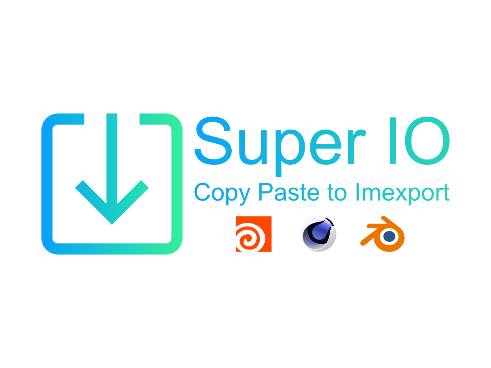

  

<h4 align="center">
    Allow you to copy and paste to import models and images.  
</h4>

    Documentation ➡️
    <a href="https://atticus-lv.gitee.io/super_io/#/">
	[Gitee] 
    </a>
    Blender 2.83 ~ 3.0

# Intro

SPIO is a blender addon that allow you to copy and paste to import models and images. 

Currently we can not drag and drop to import model in blender, but with this addon, you can easily copy your model/Image in your File Explorer, then paste in blender with just one click/shortcut !

Import model / image never so easily in blender before.

# Contributing
SPIO needs help from you! 

Translation, different platform support, and new features which come from great idea.

# Log

### v1.2.8

错误修复
+ 修复io类型弹出过滤器
+ 修复mac测试导致的导出错误

本地化
+ 将翻译文件更改为json文件

新
+ 实验功能：插件安装程序

### v1.2.7

2021.12.10

+ 实验功能：导出模型/材质资产
+ 修复 gltf 导出器
+ 修复导入菜单中显示的导出配置
+ ui 改进

### v1.2.6

2021.12.09

+ 添加检查更新运算符_

### v1.2.5

2021.12.06

+ 集成配置系统至 Super Export

### v1.2

2021.12.04

+ 一键模型导出 （ctrl shift c），可将选中物体一键导出为（blend/obj/stl/fbx）
  + 导出后复制至剪切板，可一键黏贴到需要的位置，便于发送于整理资产
  + blend文件导出后将打包所有外部引用资产
  + obj/stl/fbx文件支持批量导出功能（按下alt后，每个物体导出为单独文件）
+ 一键图像导出 （ctrl shift c）
  + 图像编辑器中，可选择将图片导出为像素（不支持透明像素）/图像文件，前者可一键黏贴至ps等图像编辑软件

### v1.1.1

2021.12.02 

+ 修复 2.83~2,.92 自定义配置导入错误

### v1.1

2021.12.01 

+ 添加对macOS的初步支持
+ 修复兼容2.83所导致的错误
+ 对win平台添加图像编辑器的一键导出功能（不支持透明像素）

### v1.0.1

2021.11.30  

+ 正式发布