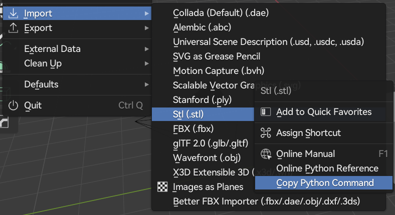
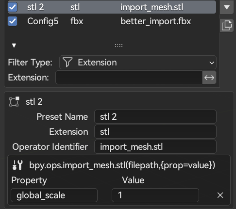
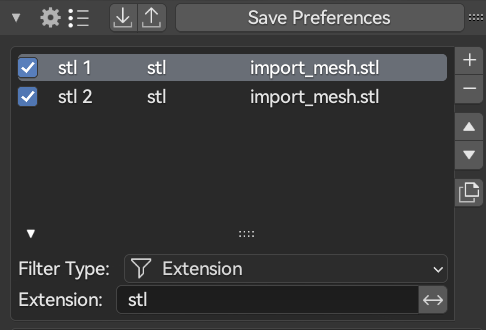
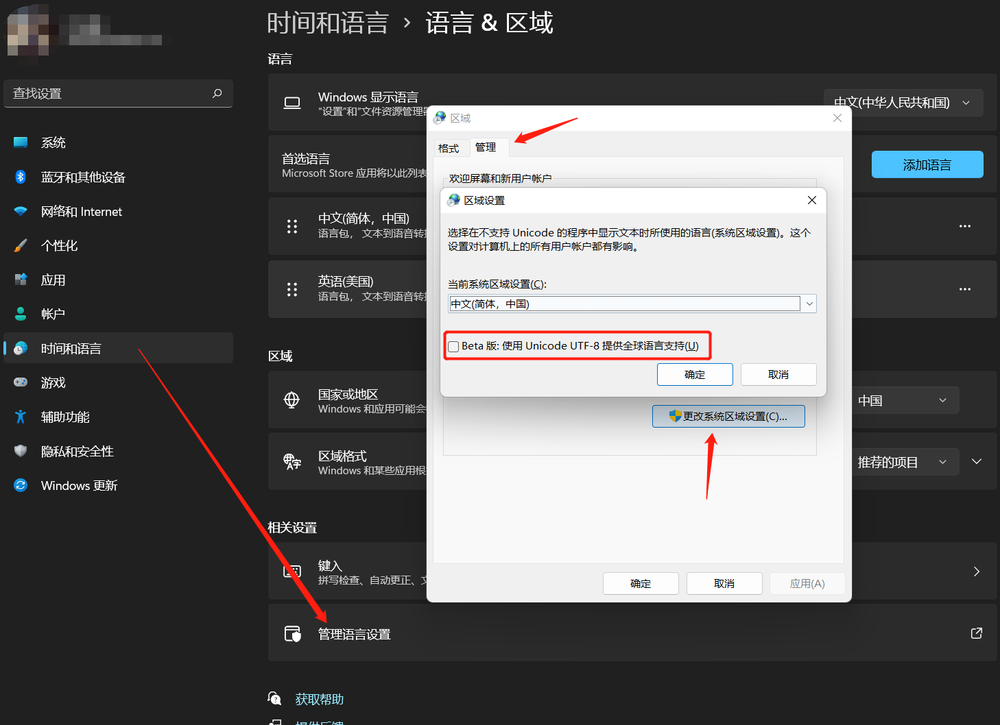

# Super Import (SPIO)

> Only support windows now (I don't have mac or linux computer)

SPIO is a blender addon that allow you to copy and paste to import models and images. 

Currently we can not drag and drop to import model in blender, but with this addon, you can easily copy your model/Image in your File Explorer, then paste in blender with just one click/shortcut !

Import model / image never so easily in blender before.

## Feature

> SPIO have a config system for advance user. Normally, you don't need to add even one config to import model like .obj/.fbx./.dae/.usd which blender supported by default
>
> But if you want to use your own addon(Like Better FBX), or your own operator, SPIO's config system make sense.

### 1.Custom rules

SPIO comes with lots of build-in operator, they all support batch import mode. 

If you have you own style of naming to manage your file(mostly is .blend I think), SPIO will give you a surprise. 

You are allow to directly import your custom naming file (import all material/collection/world/nodes)

Accidently, If you don't make a correct config for the missing file, SPIO will still popup other config with same extension setting, also with the default importer menu

### 2.Custom extension / operator

You are allow to assign a operator to import a certain types of file, with rule.

Just need to fill in the `extension` with your file suffix (like obj), and copy and paste the python command to the `Operator Idenfitier`.



Though the operator identifier will auto correct the itself, you are still need to pay attention to the format.

Right: `import_mesh.stl`

Error: `bpy.ops.import_mesh.stl(prop = value)`

### 2.Operator Property

You are allow to set most of the property of  your custom operator with a prop list. 



### 3.Config Filter

If you have hundreds of config, you can search and filter it with both extension / config name.



### 4.Import / Export Config

Config can be import or export with json file.

It will look like this. 

```json
{
    "config name": {
        "extension": "stl",
        "bl_idname": "import_mesh.stl",
        "prop_list": {
            "global_scale": 1,
            "axis_up": "Z"
        }
    }
}
```


## Settings

+ Force Unicode:

  force the encoding to be 'utf-8' . If you enable the same option in your windows languages settings, check it，else not.

  

+ Report time

  a small to for compare custom operator running time

