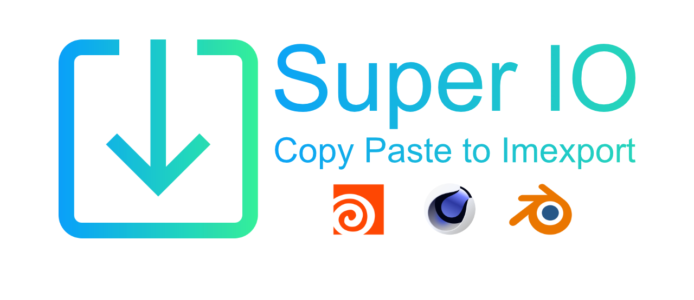
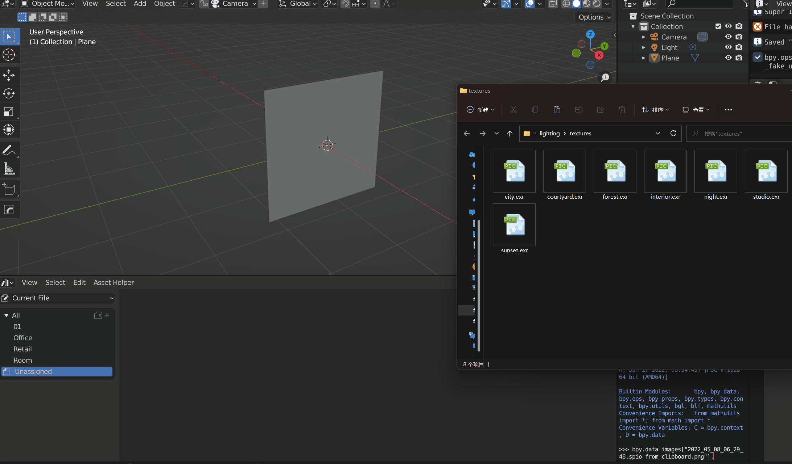
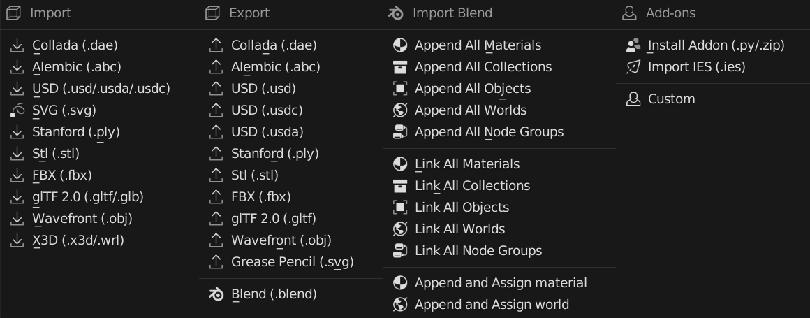
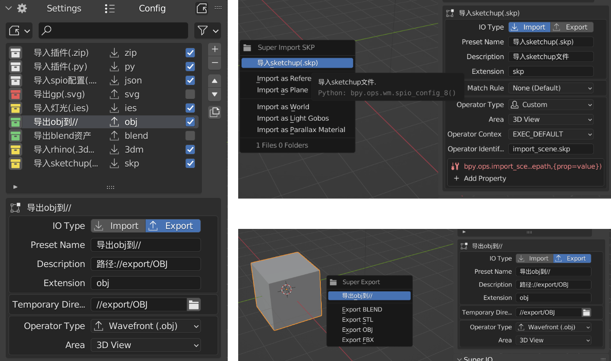
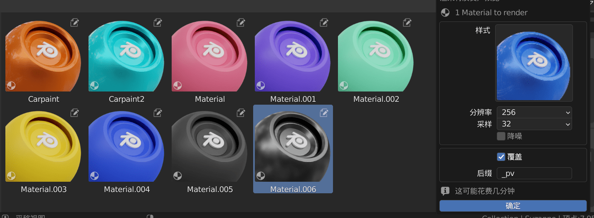
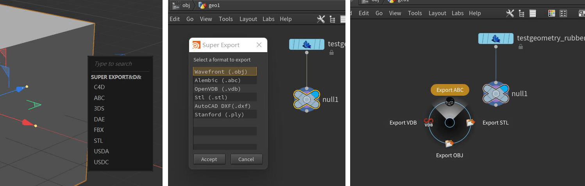

  

<h4 align="center">
    Clipboard-driven import and export shortcuts for Blender 5.  
</h4>

    <a href="https://atticus-lv.github.io/super_io/">Documentation</a>
    ·
    <a href="https://atticus-lv.github.io/super_io/zh/">中文文档</a>
    ·
    <a href="https://github.com/atticus-lv/super_io/releases">Releases</a>
    ·
    Blender 5.0+

# Version Support

Super IO 2.x is a Blender 5.0+ extension.

Older Blender versions are no longer supported by the latest release. If you use Blender 4.x or earlier, download an older Super IO release from the [GitHub Releases page](https://github.com/atticus-lv/super_io/releases).

# Installation

Download the packaged `super_io-*.zip` file from [GitHub Releases](https://github.com/atticus-lv/super_io/releases).

Do not install the GitHub source code zip directly. Blender extensions need the packaged release zip with the correct extension structure.

In Blender 5:

1. Drag the downloaded `super_io-*.zip` into the Blender window.
2. Click `Install` when Blender asks how to handle the file.
3. Enable Super IO after installation.

For Blender 4.x or earlier, use an older release from the [release history](https://github.com/atticus-lv/super_io/releases) and install it as the legacy add-on version.

# Upgrade Notes

Super IO 2.x migrates the old add-on data to a versioned JSON configuration file. Custom import/export settings from older versions are still kept and migrated when possible.

Before upgrading from an older Super IO version, it is recommended to export or back up your custom import/export configuration.

# Intro

**Super IO is a Blender extension that lets you copy and paste to import or export files.**

Copy models, images, blend files, SVG files, or folders in your file manager, then paste them into Blender with a shortcut.
You can also export selected objects or images and place the result back on the clipboard.

Super IO 2.x uses Blender 5's extension format and stores custom import/export rules in a versioned JSON configuration file.

For installation, upgrade notes, and custom configuration examples, see the [documentation](https://atticus-lv.github.io/super_io/).

# Contributing

Translation, documentation, different platform support.

And new features which come from great idea!

# Feature

> Check the [documentation](https://atticus-lv.github.io/super_io/) for more information.

### Import

> Supports multi-format import (recommended only when importing textures)

#### Import by default

+ PS selection screenshots directly copied and imported

+ AI vector graphics directly copied and imported

+ copy file/dir path to import files

+ All model formats supported by blender (batch)

+ blender file (batch)

#### Import presets

+ Import pbr image and set bsdf material (develop basic on node wrangle)

+ Batch import folder containing pbr images as materials

+ Import image as plane

+ Import images as reference empty objects

+ Import images as texture lights (assets)

+ Import images as worlds (assets)

+ Import images as parallax maps materials (assets)

+ Import images as nodes (shaders, geometry nodes, compositing)

#### Export

+ Export shader nodes as images (and generate new nodes)

+ Export rendered image to clipboard clipboard file

+ Export the selected model to a format supported by blender (single batch)

+ Export the selected model to blend format

#### Advanced import and export

+ Custom import and export configuration

+ Imports: Custom rules identify imports (file type, operator type, prefix suffix, etc.)

+ Export: custom export folder (file type, operator type)

### Asset Helper

#### NodeGroup

+ Mark group nodes as assets

+ Mark the current edit node tree as an asset (geometry node)

#### Selected: Mark Helper

+ Actionable list (to exclude unwanted ones)

#### Asset Manager

+ Batch render world previews
+ Batch render material previews
+ Batch replace asset thumbnail
+ Batch tag authors
+ Batch clean assets (or clean and set fake-users)
+ Batch add asset tags
+ Activate object viewport screenshot and set preview

### Third Party Addon

> c4d plugin (R23+), houdini shelf tool / pie menu

# Thanks

> Thanks to these projects, I can not think of what I would do without them:

+ [ImagePaste](https://github.com/Yeetus3141/ImagePaste)
+ [t3dn-bip](https://3dninjas.github.io/3dn-bip/)
