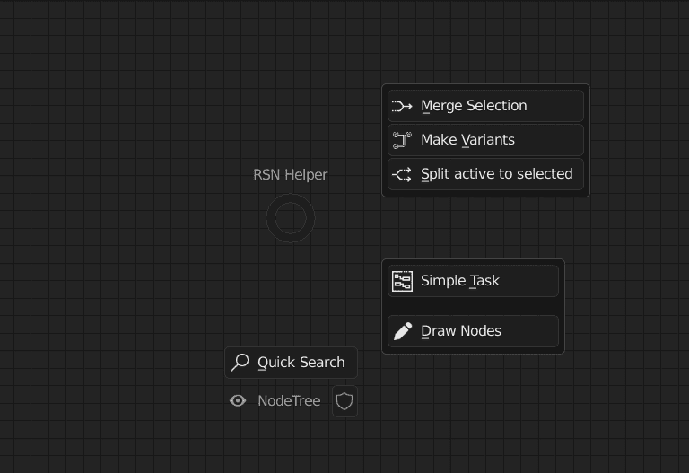
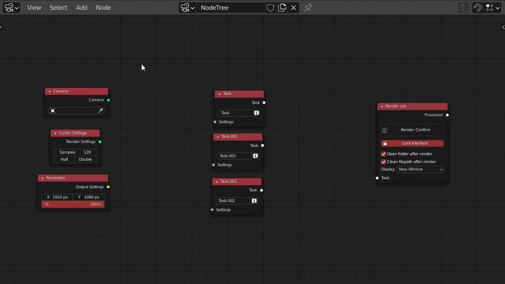
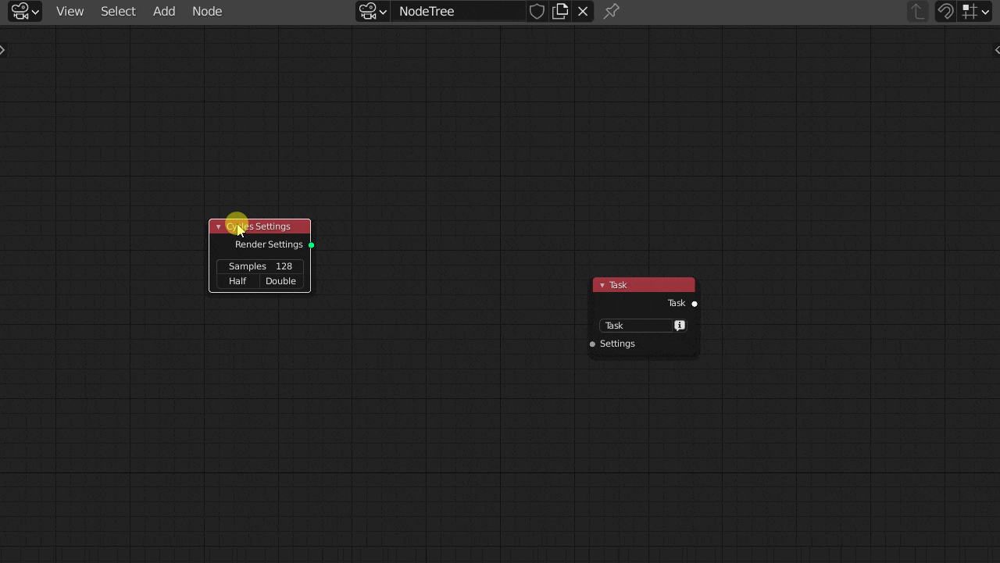
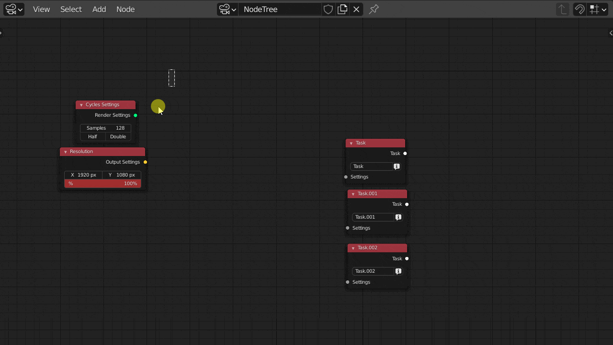
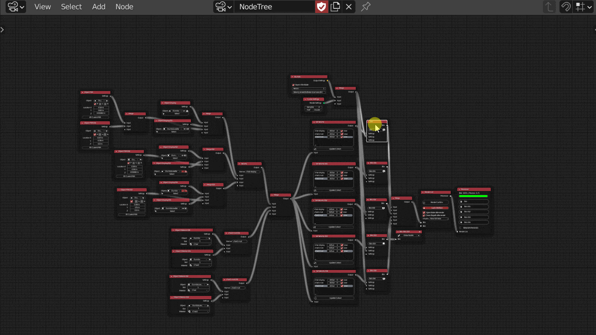
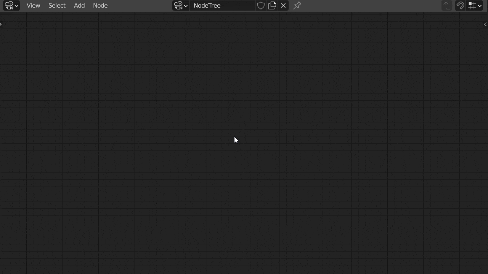

> RSN Helper is a collection of useful gadgets, designed to improve the interactivity and efficiency of RSN plug-ins, so that users can get a better experience and feedback By default, you can use the shortcut key F to call out on the RSN node panel
>
> Mainly divided into the following parts

### Example

Used to show the most basic task structure

> Click on Simple Task Can generate a simple and completetask

### Quick connect

#### Merge selected

> Click on merge selection can merge the selected nodes into a merge node

#### Set variants

> Click on make variant combine the selected nodes into a variant node

#### One to many

> Click on split active to selected Connect the activated node (white border, one and only one, shift click to set) to other selected nodes

### Viewport node drawing

> Click on draw nodes（This option is also available on the viewer node） Used to prompt the user to apply key information such as the node and output path in the complex node tree
>
> The color can be changed in the preferences

### Jump/Search

> Used to help users quickly jump to the node tree and add nodes
>
> The Tab key is the default quick search shortcut key, which can be changed in the keymaps of preferences. This shortcut key also works on all default node panels of Blender

