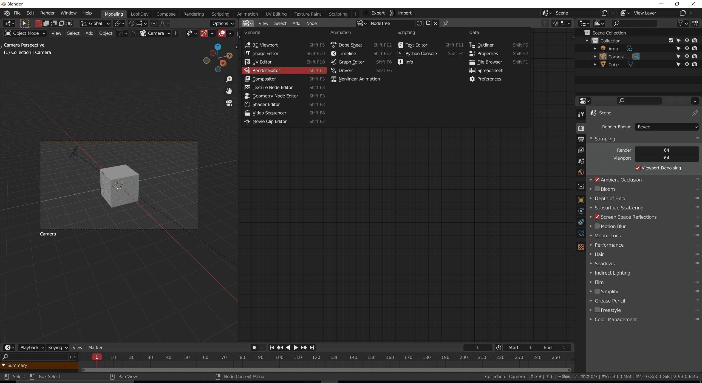
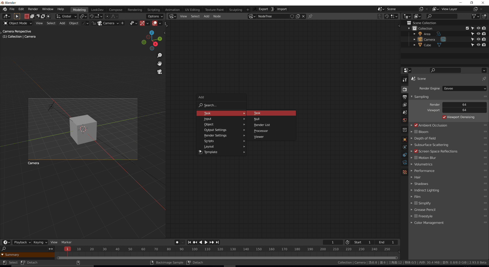
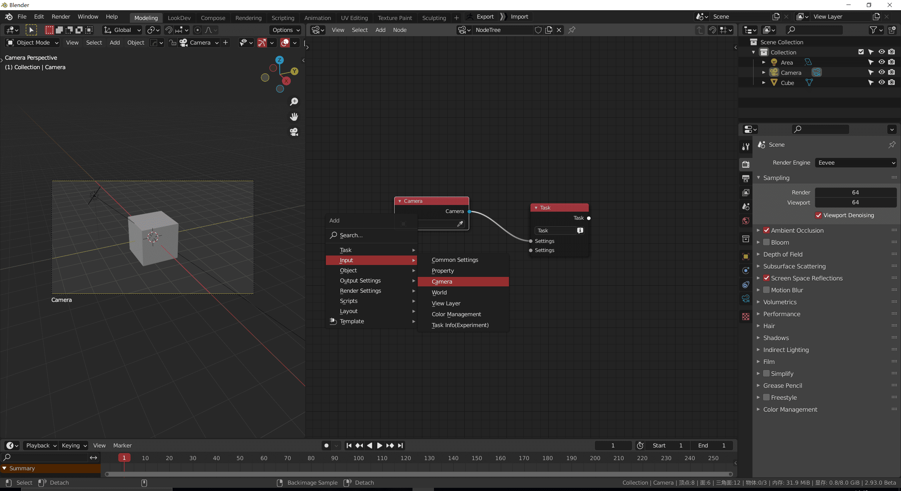
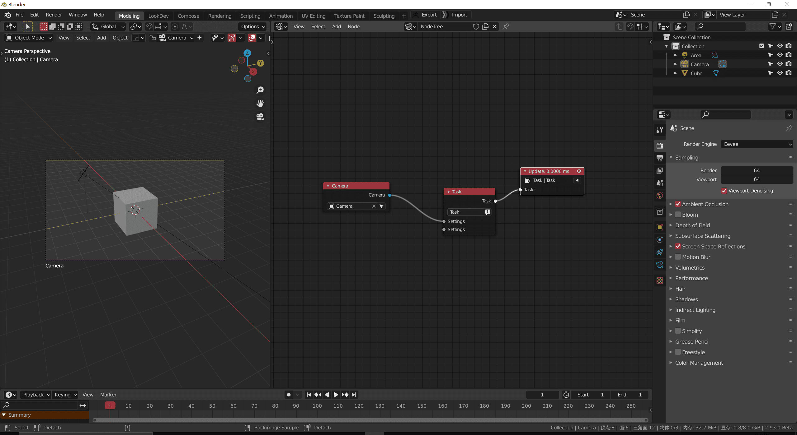
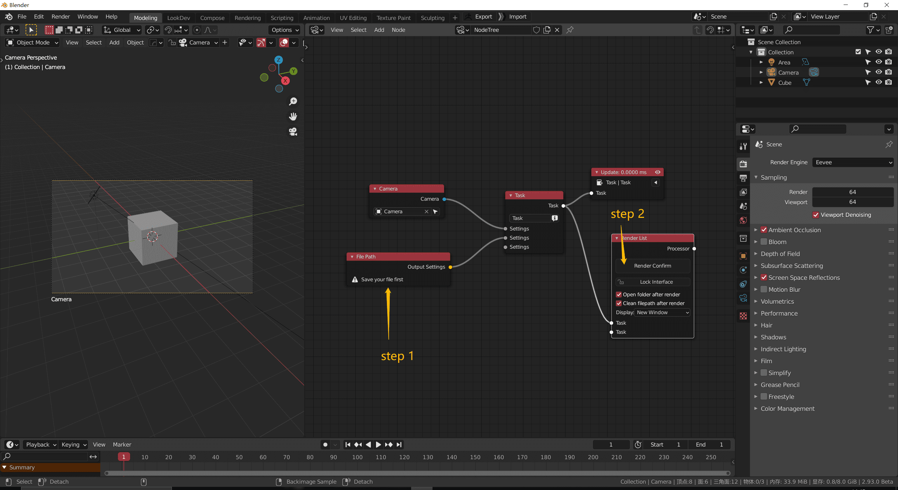
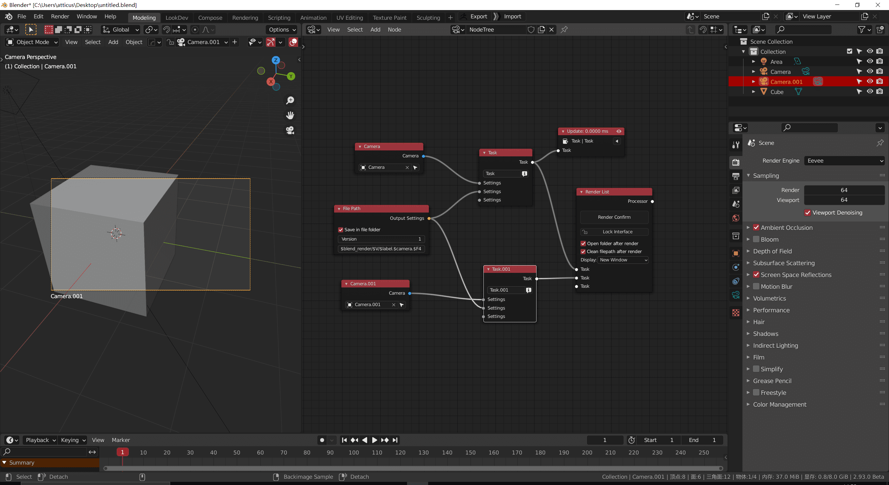

[comment]: <> "👇 Check this video !"

[comment]: <> "[test video]&#40;media/video/test.mp4 ':include :type=video controls width=960px'&#41;"

---

<!-- panels:start -->

<!-- div:title-panel -->

# Step by Step

### 1. Switch to the render editor

<!-- div:left-panel -->

<!-- div:right-panel -->

> [!NOTE]
> You can press shortcut F to add a new node tree
>
> Remember to enable the fake user

<!-- panels:end -->

<!-- panels:start -->

<!-- div:title-panel -->

### 2. Drop down a task node

<!-- div:left-panel -->

<!-- div:right-panel -->

> [!NOTE]
> Task node collect all the settings nodes

<!-- panels:end -->

<!-- panels:start -->

<!-- div:title-panel -->

### 3. Link some settings node that you want to overwrite

<!-- div:left-panel -->

<!-- div:right-panel -->

> [!NOTE]
> In this picture, I link a camera node
>
> this node can help us set the scene camera

<!-- panels:end -->

<!-- panels:start -->

<!-- div:title-panel -->

### 4. Use viewer node to apply settings to the scene

<!-- div:left-panel -->

<!-- div:right-panel -->

> [!NOTE]
> select the task node, press shortcut V to add a viewer node that links to it
>
> There should be only one viewer node in the nodetree

<!-- panels:end -->

<!-- panels:start -->

<!-- div:title-panel -->

### 5. Drop a file path node, renderlist node and render

<!-- div:left-panel -->

<!-- div:right-panel -->

> [!NOTE]
> **Save your file first!**
>
> otherwise, you won't be able to render
>
> FilePath node provides a formatted file name

<!-- panels:end -->

<!-- panels:start -->

<!-- div:title-panel -->

### 6. add a new task for an other camera

<!-- div:left-panel -->

<!-- div:right-panel -->

> [!NOTE]
> If you want to render 2 camera, you can set up 2 task
>
> they have the same file path node, but a different camera node

<!-- panels:end -->

